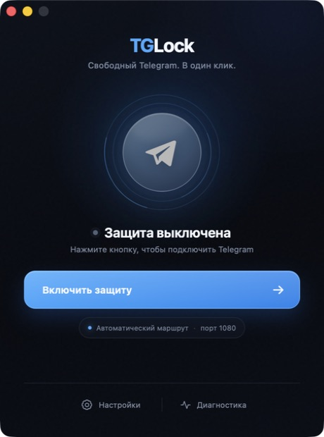

<!-- ════════════════════════ ROSEVPN — sponsor ════════════════════════ -->

<p align="center">
  <a href="https://t.me/rosevpnru_bot">
    
  </a>
</p>

<p align="center">
  <b>Быстрый VPN для России</b> — YouTube без буферизации, Discord/Instagram/ChatGPT снова работают.<br/>
  <sub>Подключение в Telegram через <a href="https://t.me/rosevpnru_bot"><b>@rosevpnru_bot</b></a> — бесплатный пробный период, без регистрации, без карты.</sub>
</p>

<p align="center">
  <a href="https://t.me/rosevpnru_bot"></a>
  <a href="https://t.me/rosevpnru_bot"></a>
  <a href="https://t.me/rosevpnru_bot"></a>
  <a href="https://t.me/rosevpnru_bot"></a>
</p>

---

<!-- ═════════════════════════════ TGLOCK ═════════════════════════════ -->

<div align="center">

# 🔓 TGLock

### Обход блокировки Telegram через WebSocket-туннель

**Один клик. Без VPN. Без серверов. Без подписки.**

<p>
  <a href="https://github.com/by-sonic/tglock/releases/latest"></a>
  <a href="https://github.com/by-sonic/tglock/releases"></a>
  <a href="https://github.com/by-sonic/tglock/stargazers"></a>
</p>

<p>
  
  
  
  
  <a href="LICENSE"></a>
</p>

</div>

> **Telegram стал тормозить или перестал открываться?** Запусти TGLock — и мессенджер снова работает. Не нужны VPN, прокси-серверы, абонентская плата или регистрация.

<p align="center">
  
</p>

---

## 🤔 Что это и зачем

TGLock — это **локальный прокси** на твоём компьютере: принимает и MTProto, и SOCKS5. Он перехватывает соединения Telegram, заворачивает их в WebSocket и отправляет на веб-инфраструктуру Telegram — по нескольким маршрутам сразу, переключаясь на следующий, если текущий перестал отвечать. Провайдер видит обычный HTTPS.

**Кому подойдёт:**

- 📱 Telegram открывается через раз, сообщения уходят с задержкой, фото и видео не грузятся
- 🛡 GoodbyeDPI, Zapret или ByeDPI больше не помогают — провайдер шейпит **по IP**
- 🍎 Нужен графический интерфейс под **macOS**
- 💻 Нужно решение для **Windows, macOS или Linux** без подписок и без своего сервера
- 🖥 Нужен вариант **для сервера или машины без монитора** — для этого есть [`tglock-cli`](#-без-графического-интерфейса-tglock-cli)

**Чего TGLock не делает** — честно, чтобы не тратить твоё время:

- ❌ **Голосовые и видеозвонки.** Они идут по UDP, а TGLock проксирует только TCP. Со звонками ничего не изменится
- ❌ **Всё, кроме Telegram.** YouTube, Discord, Instagram, ChatGPT работать не начнут: TGLock разворачивает только MTProto — протокол, который больше нигде не используется
- ❌ **Android и iOS.** Своего приложения нет. Телефон можно подключить к TGLock на компьютере через [LAN-режим](#-lan-режим--один-прокси-на-всю-квартиру)

**Чем отличается от VPN:** TGLock работает **только с Telegram**. Остальной трафик идёт напрямую — ничего не замедляется, мобильный трафик не расходуется впустую.

---

## ⚡ Скачать

**[👉 Последний релиз](https://github.com/by-sonic/tglock/releases/latest)**

| Платформа | Файл |
|---|---|
| **Windows 10/11** (x64) | `_x64-setup.exe` |
| **macOS** (Apple Silicon + Intel) | universal `.dmg` |
| **Linux** (x86_64) | `.deb` |
| **Linux** (x86_64, портативно) | `.AppImage` |
| **Сервер, контейнер, машина без монитора** | `tglock-cli-*` |

Все сборки весят единицы мегабайт. Исключение — `.AppImage`: он несёт своё окружение и поэтому крупный.

> **🖥 `tglock-cli`** — тот же туннель без графического интерфейса, одним бинарём. Нужен там, где окно не создаётся: сервер, контейнер, виртуалка, машина без монитора. Доступен начиная с `v2.0.0-beta.2`. Подробности — [ниже](#-без-графического-интерфейса-tglock-cli).

> **🍎 macOS:** пока сборка не нотарифицирована Apple, при первом запуске может понадобиться:
> ```bash
> xattr -cr /Applications/TGLock.app
> ```
> Это снимает карантин Gatekeeper с приложения, скачанного из GitHub.

---

## 🚀 Как пользоваться

1. **Скачай и запусти** приложение для своей системы.
2. Нажми **«Включить защиту»**.
3. TGLock откроет Telegram и предложит подключить локальный MTProto-прокси.
4. ✅ **Telegram работает.** Окно TGLock можно свернуть.

### Ручная настройка (если автоматическая не сработала)

Telegram → Настройки → **Продвинутые** → Тип соединения → **Использовать прокси** → **SOCKS5**

- Сервер: `127.0.0.1`
- Порт: `1080`

### 🏠 LAN-режим — один прокси на всю квартиру

В окне TGLock включи галочку **LAN** — приложение начнёт слушать на `0.0.0.0`. Все устройства в домашней сети (телефон, планшет, ноутбук, телевизор) смогут подключиться к `<IP-компьютера>:1080` и тоже получить рабочий Telegram.

Ссылку `tg://proxy` с уже подставленным адресом TGLock открывает сам при включении — её достаточно переслать себе в Telegram и открыть на телефоне. Если нужен адрес руками: `ipconfig` на Windows, `ip a` на Linux, `ifconfig` на macOS.

Удобно, если дома один компьютер всегда включён — он становится «домашним Telegram-роутером».

В LAN-режиме TGLock пропускает **только адреса Telegram**. Открытым SOCKS5-прокси для всего интернета он при этом не становится — иначе им бы воспользовались не только твои устройства.

### 🖥 Без графического интерфейса: `tglock-cli`

Для сервера, виртуалки, контейнера и машины без монитора или без 3D-ускорения. Это отдельный бинарь, в котором **нет ни Tauri, ни системного WebView** — там, где окно просто не создаётся, CLI работает.

```bash
tglock-cli                                # 127.0.0.1:1080, только для этого компьютера
tglock-cli --lan                           # 0.0.0.0:1080, только адреса Telegram
tglock-cli --bind 10.0.0.5 --port 1443     # свой адрес и порт
tglock-cli --worker my-name.workers.dev    # резервный маршрут, см. docs/CLOUDFLARE_WORKER.md
tglock-cli --help                          # все флаги
```

При запуске печатается готовая `tg://proxy`-ссылка — её можно открыть на любом устройстве в сети, чтобы Telegram настроился сам. Дальше в лог идёт по строке на каждое изменение состояния: сколько соединений, какой дата-центр, какой маршрут живой, сколько сбоев.

Прав администратора не нужно: TGLock не правит ни системный DNS, ни файл `hosts` — нужные адреса Telegram зашиты в маршрутах, а TLS SNI остаётся настоящим.

`--lan` и любой другой сетевой адрес пропускают **только** адреса Telegram. Обычным SOCKS5-прокси TGLock становится исключительно по явному `--allow-direct`, и на сетевом адресе это открытый прокси для всего интернета — включайте осознанно.

#### Юнит для systemd

```ini
[Unit]
Description=TGLock — Telegram через WebSocket-туннель
After=network-online.target
Wants=network-online.target

[Service]
Type=exec
ExecStart=/usr/local/bin/tglock-cli --lan --secret-file /var/lib/tglock/secret
Restart=on-failure
RestartSec=5s
StateDirectory=tglock
DynamicUser=yes
NoNewPrivileges=yes
ProtectSystem=strict
ProtectHome=yes
PrivateTmp=yes
RestrictAddressFamilies=AF_INET AF_INET6

[Install]
WantedBy=multi-user.target
```

```bash
sudo install -m755 tglock-cli-x86_64-unknown-linux-gnu /usr/local/bin/tglock-cli
sudo systemctl enable --now tglock
journalctl -u tglock -f
```

`--secret-file` здесь обязателен, и это не украшение: секрет — половина `tg://proxy`-ссылки. Без файла он генерируется заново при каждом старте, и после первого же `systemctl restart` все настроенные клиенты перестанут подключаться. `StateDirectory=tglock` создаёт `/var/lib/tglock` с нужными правами, а сам файл пишется с режимом `600`.

Остановка по `systemctl stop` приходит как `SIGTERM` — CLI закрывает туннели и выходит с нулевым кодом, а не умирает по `SIGKILL`.

#### Docker

```dockerfile
FROM rust:1.88 AS build
WORKDIR /src
COPY . .
RUN cargo build --release --locked --no-default-features --bin tglock-cli

FROM debian:bookworm-slim
RUN apt-get update && apt-get install -y --no-install-recommends ca-certificates \
    && rm -rf /var/lib/apt/lists/*
COPY --from=build /src/target/release/tglock-cli /usr/local/bin/tglock-cli
EXPOSE 1080
ENTRYPOINT ["tglock-cli", "--lan", "--secret-file", "/data/secret"]
```

```bash
docker run -d --name tglock -p 1080:1080 -v tglock-data:/data tglock
```

Образу не нужны ни Node.js, ни `libwebkit2gtk` — только `ca-certificates` для проверки сертификата Telegram.

---

## 🔬 Как это работает

```
Telegram Desktop / mobile (через LAN)
              ▼
   MTProto или SOCKS5 (127.0.0.1:1080 либо 0.0.0.0:1080)
              ▼
        TGLock — читает первые 64 байта
                 obfuscated2 init-пакета,
                 расшифровывает AES-256-CTR,
                 достаёт номер DC
              ▼
   WSS → kws{dc}.web.telegram.org
         каскад маршрутов, см. ниже
              ▼
        Telegram Data Center
```

1. **Локальный прокси** принимает соединения Telegram: и MTProto (по ссылке `tg://proxy`), и SOCKS5.
2. Из первых 64 байт `obfuscated2`-пакета **расшифровывается номер DC** — AES-256-CTR, ключ в байтах `[8..40]`, IV в `[40..56]`, индекс DC — `i16` в `[60..62]`. Отрицательное значение означает медиа-соединение.
3. Трафик заворачивается в **WebSocket** к `kws{dc}.web.telegram.org` — это тот же домен, через который работает Telegram Web в браузере.
4. **Маршрут выбирается каскадом**, и это главное отличие 2.0 от первой версии. Один домен может резолвиться в недоступный адрес, поэтому по очереди пробуются: закреплённые IP Telegram, их дублёры `kwsN-1`, системный DNS и — если ты его настроил — твой собственный Cloudflare Worker. Упавший маршрут уходит в cooldown с удвоением задержки, удачный запоминается для этого DC. Системный DNS и файл `hosts` при этом **не изменяются**: TCP-соединение идёт на закреплённый IP, а TLS SNI и заголовок `Host` остаются настоящими, поэтому сертификат Telegram проверяется как обычно.
5. Провайдер видит **TLS-handshake к `web.telegram.org`** — легитимный HTTPS, MTProto в нём не виден.
6. Весь остальной трафик (не-Telegram) проходит **напрямую** — без замедления.

> Интерфейс различает три состояния и не выдаёт одно за другое: **«Защита включена»** — локальный порт открыт, туннеля пока нет; **«Ищем новый маршрут»** — попытки были неудачными, идёт перебор; **«Telegram на связи»** — есть установленный туннель, то есть WebSocket-рукопожатие уже прошло. Смешивание первого и третьего состояния и было основной причиной жалоб «прокси подключён, а Telegram не работает».

📖 **Архитектура 2.0, различение протоколов и честный список ограничений** — [docs/ARCHITECTURE_V2.md](docs/ARCHITECTURE_V2.md). Запасной маршрут через свой Cloudflare Worker, со скриптом и пошаговой установкой — [docs/CLOUDFLARE_WORKER.md](docs/CLOUDFLARE_WORKER.md). Разбор всех issue и того, что в них было обещано зря — [docs/ISSUE_AUDIT.md](docs/ISSUE_AUDIT.md). Черновик статьи про переход v1 → v2 лежит в [HABR.md](HABR.md) — цифры там описывают код на момент написания, документацией он не является.

---

## 🆚 Сравнение с альтернативами

| | GoodbyeDPI | Zapret | AmneziaVPN | **TGLock** |
|---|:---:|:---:|:---:|:---:|
| Подход | Фрагментация пакетов | TCP/UDP desync | Полноценный VPN-туннель | **WebSocket-туннель** |
| Обходит IP-шейпинг | ❌ | ❌ | ✅ | **✅** |
| macOS (GUI) | ❌ Windows only | ❌ только CLI | ✅ | **✅** |
| Нужен сервер / подписка | ❌ | ❌ | ✅ ($) | **❌** |
| Только Telegram | ❌ | ❌ | ❌ | **✅** |
| LAN-шаринг | ❌ | сложно | ✅ | **✅ (галочка)** |
| Режим без GUI | ✅ | ✅ | ❌ | **✅ (`tglock-cli`)** |
| Размер | ~200 КБ | ~5 МБ | ~80 МБ | **2 МБ установщик, 2 МБ CLI** |
| Цена | 0 ₽ | 0 ₽ | свой сервер | **0 ₽** |

> **⚠ Когда TGLock не подойдёт:** если заблокирован не только Telegram, а ещё YouTube, Discord, Instagram или ChatGPT — обходить каждый сервис отдельно смысла нет, нужен полноценный VPN. TGLock эту задачу не решает и решать не будет: он разворачивает только MTProto.
>
> Звонки тоже не заработают — они по UDP, а TGLock проксирует только TCP.

---

## ❓ Часто задаваемые вопросы

<details>
<summary><b>Telegram заблокировали в России — это правда?</b></summary>

Полностью Telegram в РФ не заблокирован, но провайдеры **замедляют** трафик через DPI и **шейпят по IP-диапазонам** Telegram DC (149.154.160–175, 91.108.4–8, 91.108.56–59 и др.). У части пользователей мессенджер открывается через раз, видео не грузится, фото уходят минутами.

TGLock решает именно это — заворачивает Telegram-трафик в HTTPS к веб-инфраструктуре Telegram, которая под шейпинг не попадает. **Голосовые и видеозвонки он не лечит:** они идут по UDP, а TGLock проксирует только TCP.
</details>

<details>
<summary><b>Это безопасно? Что с моими данными?</b></summary>

TGLock — **локальный прокси**. Он работает только на твоём компьютере и не отправляет данные третьим сторонам. Соединение идёт к серверам Telegram через их же домен `web.telegram.org` — тот же, что использует Telegram Web в браузере. Единственное исключение — если ты сам укажешь в настройках свой Cloudflare Worker как резервный маршрут; по умолчанию это поле пустое, и никакой сторонней инфраструктуры в схеме нет.

Кода — около 2900 строк Rust (из них ~1100 приходится на тесты) и ~380 строк TypeScript на интерфейс. Всё открыто, можно прочитать и собрать самому. Бинарники в релизах собираются из этого же исходника в GitHub Actions — логи сборки публичные.
</details>

<details>
<summary><b>Чем отличается от GoodbyeDPI / Zapret / ByeDPI?</b></summary>

GoodbyeDPI, Zapret и ByeDPI **фрагментируют пакеты**, чтобы DPI не распознал MTProto. Это работает, пока провайдер блокирует *по содержимому*. Но если шейпинг идёт **по IP** (а так делают большинство крупных РФ-провайдеров с 2024–2026 — Ростелеком, МТС, Билайн, Мегафон), фрагментация не помогает: пакеты всё равно идут на «нехороший» IP и троттлятся.

TGLock же отправляет трафик на **`web.telegram.org`** — обычный HTTPS-домен, который под IP-шейпинг Telegram DC не попадает.
</details>

<details>
<summary><b>Работает ли на iPhone или Android?</b></summary>

Своего приложения под Android и iOS нет — TGLock только для desktop. Есть два обходных пути:

1. **LAN-режим на компьютере.** Включи галочку LAN, и в настройках Telegram на телефоне укажи прокси с IP компьютера. Работает, пока компьютер включён и телефон в той же сети.
2. **`tglock-cli` на своём VPS.** Headless-бинарь запускается как systemd-сервис, слушает `0.0.0.0` и пропускает только адреса Telegram — тогда телефон работает откуда угодно, а не только из дома. См. [раздел про CLI](#-без-графического-интерфейса-tglock-cli).

Поддержка Android обсуждается в [#9](https://github.com/by-sonic/tglock/issues/9), сроков нет: Tauri 2 умеет собирать под Android, но перехват трафика там делается через `VpnService` — это другая архитектура, а не пересборка того же кода.
</details>

<details>
<summary><b>Замедляет ли TGLock интернет?</b></summary>

Нет. Через прокси идёт **только** трафик Telegram (фильтрация по IP-диапазонам Telegram DC). YouTube, браузер, игры, торренты — всё это идёт напрямую и не замедляется. В этом главное отличие от VPN.
</details>

<details>
<summary><b>Apple ругается «приложение не проверено / нельзя открыть»</b></summary>

Сборка пока не подписана и не нотарифицирована — Apple Developer ID стоит $99 в год. Сними карантин Gatekeeper руками: перенеси приложение из `.dmg` в «Программы» и выполни в Терминале

```bash
xattr -cr /Applications/TGLock.app
```

После этого приложение запустится двойным кликом из Finder.
</details>

<details>
<summary><b>Telegram пишет «прокси не настроен» или сразу отключается</b></summary>

Открой TGLock — он должен показывать **«ПОДКЛЮЧЕНО»** и хотя бы одно активное соединение, когда Telegram пытается работать. Если соединений ноль:

- Не запущен ли уже другой прокси на порту 1080? В TGLock можно поменять порт в настройках.
- Антивирус/файрвол не блокирует localhost-подключения?
- В настройках Telegram сервер указан как `127.0.0.1`, не `localhost` — на некоторых системах это разные сетевые стеки.
- На macOS — убедись что снят Gatekeeper (`xattr -cr ...`).
</details>

<details>
<summary><b>Приложение вообще не запускается — окно не появляется</b></summary>

Так проявляется отсутствие 3D-ускорения: интерфейс построен на системном WebView, а тот без ускорения окно не создаёт. Отсюда же случаи «не работает в виртуалке», «не стартует с дефолтным драйвером Microsoft» и «нет монитора».

Начиная с **2.0.0-beta.2** TGLock сам просит у WebView программный рендер, так что на таких машинах должен запускаться. Если хочется вернуть аппаратное ускорение — запусти с переменной `TGLOCK_FORCE_GPU=1`.

Если окно всё равно не появилось, интерфейс тебе и не нужен: возьми [`tglock-cli`](#-без-графического-интерфейса-tglock-cli), которому WebView не требуется вообще. И напиши в [#10](https://github.com/by-sonic/tglock/issues/10) или [#17](https://github.com/by-sonic/tglock/issues/17), что именно за система — это как раз те ишью.
</details>

<details>
<summary><b>Порт 1080 уже занят другим приложением</b></summary>

В окне TGLock есть поле **«Порт»** — поменяй на любой свободный (например, `10800`, `1081`, `8888`). После рестарта прокси автоматически обновит deep-link для Telegram. В настройках Telegram укажи новый порт.
</details>

<details>
<summary><b>А что если провайдер заблокирует и <code>web.telegram.org</code>?</b></summary>

Это реальный риск, и TGLock 2.0 к нему подготовлен настолько, насколько может.

Маршрут не один: пробуются закреплённые IP Telegram, дублёры `kwsN-1` и системный DNS. Пока жив хотя бы один — туннель поднимается.

Если у твоего провайдера легли **все** маршруты, есть запасной выход — **свой Cloudflare Worker**. Тогда соединение идёт на твой домен `*.workers.dev`, а воркер доводит его до Telegram; блокировать его провайдеру придётся отдельно. Готовый скрипт и пошаговая установка: **[docs/CLOUDFLARE_WORKER.md](docs/CLOUDFLARE_WORKER.md)**. Нужен только аккаунт Cloudflare, бесплатного тарифа хватает, свой сервер и домен не нужны.

Признак, что пора это делать: приложение показывает «Ищем новый маршрут» и не проходит, а в диагностике туннелей 0 и растёт счётчик сбоев. Если Telegram работает — настраивать ничего не надо.

Но честно: если веб-версию Telegram заблокируют так, что её не видно и из датацентров Cloudflare, подход исчерпает себя. TGLock держится на доступности `web.telegram.org`, и никакой запас маршрутов этого не отменяет.
</details>

<details>
<summary><b>Можно ли использовать TGLock как обычный SOCKS5 для других приложений?</b></summary>

Смысла нет, и по умолчанию это запрещено.

TGLock определяет Telegram по IP получателя и заворачивает в WebSocket только его. Не-Telegram адреса он релеит напрямую — без шифрования, то есть никакой пользы для обхода в этом нет.

Поэтому такой релей разрешён **только когда прокси слушает `127.0.0.1`**, где до него дотянутся лишь процессы твоего компьютера. На `0.0.0.0` и любом сетевом адресе не-Telegram запросы отклоняются: иначе LAN-режим сделал бы из твоей машины открытый прокси для всего интернета. В `tglock-cli` это можно переопределить флагом `--allow-direct` — но на сетевом адресе ты получишь именно открытый SOCKS5, так что делай это осознанно.
</details>

<details>
<summary><b>Где скачать новые версии? Будут ли обновления?</b></summary>

Все релизы — на странице **[GitHub Releases](https://github.com/by-sonic/tglock/releases)**. При пуше тега `v*` GitHub Actions собирает и публикует установщики под Windows x64, macOS (universal) и Linux x64, плюс headless `tglock-cli` под те же три платформы. Подпишись на репозиторий (кнопка **Watch** → **Custom** → **Releases**), чтобы получать уведомления.
</details>

---

## 🛠 Стек технологий

| Технология | Зачем |
|---|---|
| **Rust** | Один бинарник, нативная скорость, без runtime-зависимостей |
| **Tauri 2** | Нативная оболочка для GUI. Опциональна: за фичей `gui`, в CLI не входит |
| **TypeScript + Vite** | Интерфейс, внутренняя навигация и строгая типизация |
| **tokio** | Async I/O, обработка сигналов для корректной остановки сервиса |
| **tokio-tungstenite** | WebSocket-клиент с TLS поверх `native-tls` |
| **aes** + **ctr** | Расшифровка MTProto `obfuscated2` init-пакета |
| **clap** | Разбор аргументов `tglock-cli` |

Ядро (`src/lib.rs`: разбор MTProto, каскад маршрутов, прокси) не зависит ни от Tauri, ни от оконной системы — поэтому один и тот же код обслуживает и графический интерфейс, и headless-режим.

---

## 🏗 Сборка из исходников

```bash
git clone https://github.com/by-sonic/tglock.git
cd tglock
npm ci
npm run tauri build
```

Результат — `target/release/tglock` (или `tglock.exe` на Windows).

Минимальная версия Rust — **1.88** (`rust-version` в `Cargo.toml`, проверяется отдельной задачей в CI). На более старых тулчейнах зависимости не соберутся: часть из них требует edition 2024.

### Только CLI, без графики

```bash
cargo build --release --locked --no-default-features --bin tglock-cli
```

Ни Node.js, ни фронтенда, ни `libwebkit2gtk` для этого не нужно — при выключенной фиче `gui` Tauri и системный WebView в сборку не попадают вообще. Именно так CLI собирается на голом сервере.

### Проверки, которые гоняет CI

```bash
cargo fmt --check
cargo clippy --all-targets -- -D warnings
cargo clippy --no-default-features --lib --bins --all-targets -- -D warnings
cargo test --all-targets
cargo test --no-default-features --lib --bins
```

Тестов 59: разбор `obfuscated2`, каскад маршрутов и его cooldown, протокольные отказы SOCKS5, устойчивость секрета к перезапуску, плюс сквозной тест туннеля против мок-сервера, который реализует сторону Telegram и проверяет, что до неё доходит ровно тот открытый текст, который отправил клиент. Единственный тест с пометкой `#[ignore]` — тот, что требует живой сети.

### Свой релиз через GitHub Actions

Форкни репозиторий и поставь тег `v*` — `.github/workflows/release.yml` соберёт установщики под Windows x64, macOS (universal, Apple Silicon + Intel) и Linux x64, а также `tglock-cli` под те же три платформы, и опубликует их в релизе.

---

## 🤝 Как помочь

Проект живой, PR и баг-репорты разбираются.

- **Нашёл баг** — [открой issue](https://github.com/by-sonic/tglock/issues/new). Полезнее всего: ОС и версия, что показывает вкладка диагностики (маршрут, DC, число сбоев) и провайдер. Для `tglock-cli` — вывод из консоли.
- **Хочешь фичу** — тоже issue. Если её нет в планах, так и будет написано, без месяцев тишины.
- **Присылаешь PR** — перед отправкой прогони проверки выше, они те же, что в CI. Небольшие PR ревьюятся быстрее.
- **Не работает после релиза** — это регрессия, пиши сразу, такие вещи в приоритете.

Известные ограничения, о которых не нужно открывать issue: звонки (UDP), сервисы кроме Telegram (только MTProto), Android и iOS (обсуждается в [#9](https://github.com/by-sonic/tglock/issues/9)).

---

## 📄 Лицензия

[MIT](LICENSE) — делай что хочешь. Форки, модификации, использование в коммерческих проектах — всё разрешено. Ссылка на репозиторий приветствуется, но необязательна.

---

<p align="center">
  <sub><b>by sonic</b> · <a href="https://github.com/by-sonic/tglock/issues">Issues &amp; feedback</a> · <a href="https://github.com/by-sonic/tglock/releases">Releases</a></sub>
</p>
